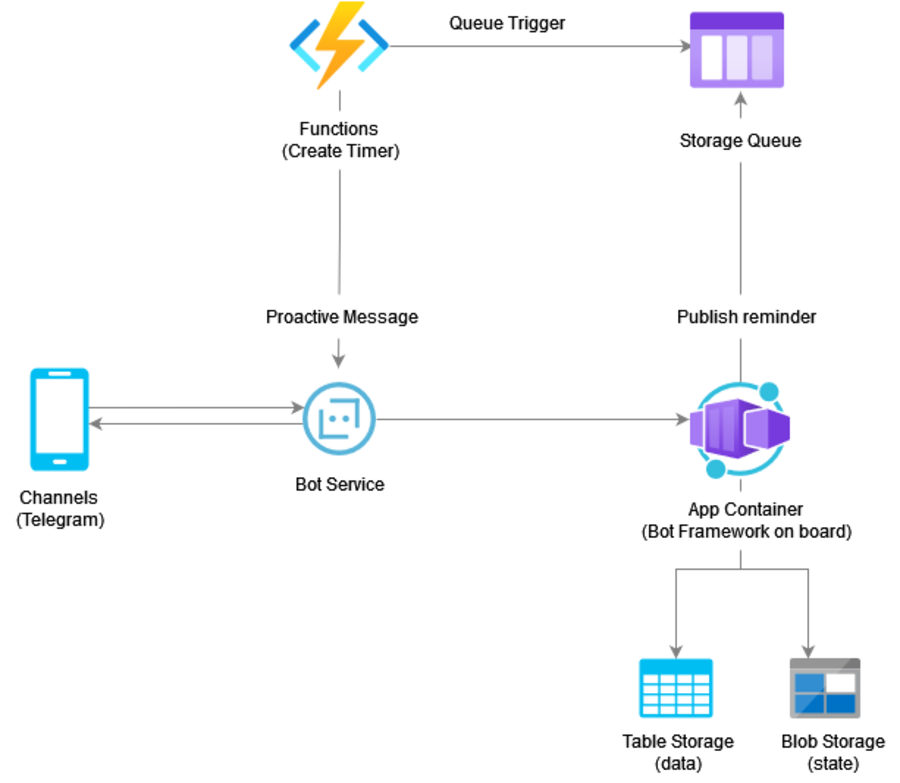

# RemindMeBot

RemindMeBot is a multilingual chatbot designed to aid you in managing your time by creating both one-time and recurrent reminders. It offers a conversational interface with an ability to process both text and voice commands. Currently, the bot supports English and Ukrainian languages.

## Features

- Creating one-time reminders
- Creating recurrent reminders on a daily, weekly, monthly, and yearly basis
- Natural Language Processing for intuitive reminder creation
- Voice message support for creating reminders
- Support for English and Ukrainian languages

## Tech

The Reminder Bot leverages the following technologies:

- **C# and MS Bot Framework**: The chatbot's core functionality is built with this technology.
- **Azure Bot Service**: The chatbot is hosted on this Microsoft cloud computing platform service.
- **Azure App Container**: It's used to host the reminder application.
- **Azure Table Storage**: This NoSQL datastore is used for storing the reminders.
- **Azure Blob Storage**: It is used for storing the bot state.
- **Azure Queue**: An Azure service utilized for managing the sequence of reminders.
- **Azure Durable Functions**: They provide a scheduler functionality using their timers feature.
- **Azure Speech Service**: This service is used to transcribe voice messages.
- **Azure Translator**: It's used to translate messages between English and Ukrainian languages.
- **Azure Maps**: It aids in recognizing and dealing with location-based reminders.
- **OpenAI API**: Leveraged for improving conversational abilities 

## Usage

Currently, the RemindMeBot is available exclusively on [Telegram](https://t.me/JustRecallMeBot). Other communication channels might be added in the future.

1. Send messages in a conversational format to the bot. Example: "Call mom in 2 hours" or "Meeting tomorrow at 2 PM".
2. For creating reminders through voice messages, send your voice message and the bot will transcribe and understand your command.
3. To set up a recurrent reminder, specify the repetition frequency in your command. Example: "Workout every day at 8 AM".

## Contributing

Pull requests are welcome. For major changes, please open an issue first to discuss what you would like to change. Please make sure to update tests if needed.

## Contact

For any questions or concerns, please contact me at: 
- Email: tronbodya@gmail.com
- LinkedIn: https://www.linkedin.com/in/bohdan-tron
